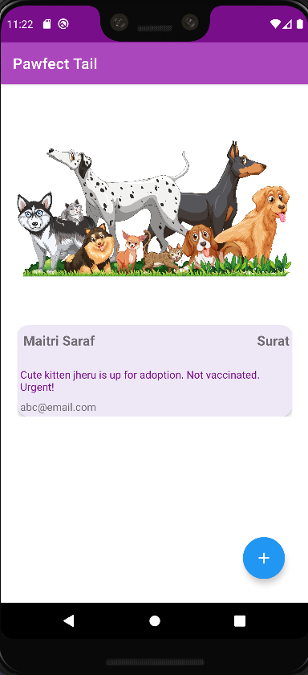
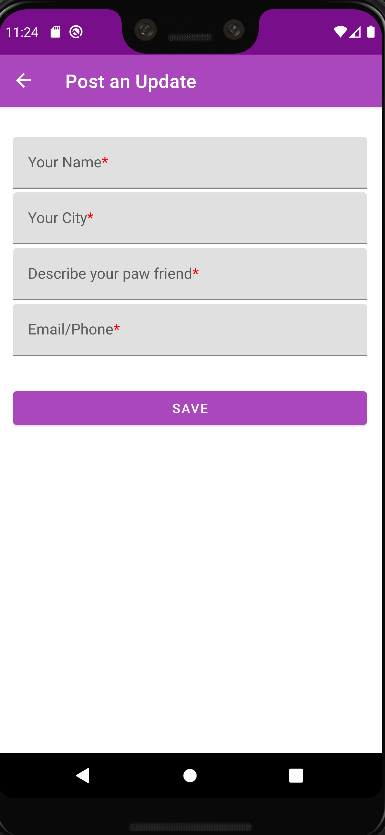
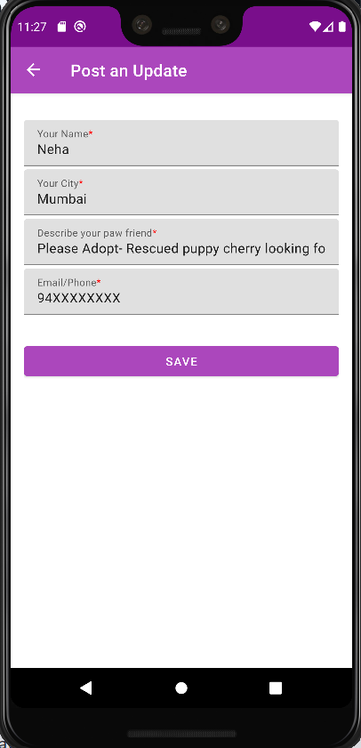
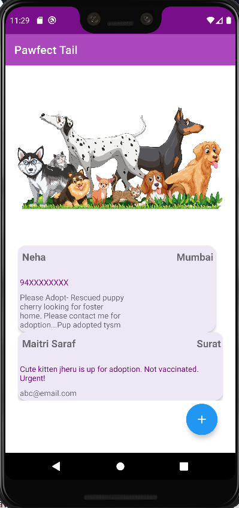
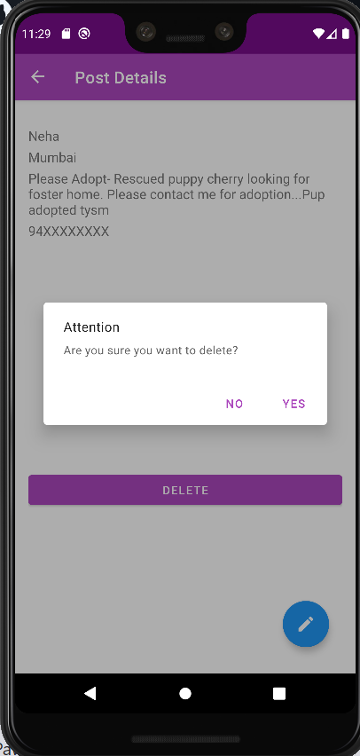

# Android-Study-Jams

Animal Welfare App

<b> Problem Statement: </b>

We see a lot of stray animals and cruelty against them. But there are some kind people who want to help them out but need some medium to do so. Due to the covid situation, people have become more inclined towards technology. For majority of people, smartphones are the main medium for accesing technology. We can develop an android app that can help connect people and try to create a better world for these cute liitle beings.

<b> Proposed Solution : </b>

This project proposes an "Animal Welfare App" where animal lover can post an update to help stray and abandoned animals by providing their name and contact information so that any person interested in helping or adopting can contact the person who put up that information. This application uses database to store the details about the person, city he/she lives in, contact information like mail/phone no. and a brief and precise description what help our paw friends needs.The scope is to extend the application to use it for a bigger social cause.

 

<!-- 

 -->

<b> Functionality & Concepts used : </b>

This app is intutive,user friendly and has interactive design to make it easier for people to get access and post their update regarding the furry friends. The app built using android studio has following android concepts used to get the features:
- <b>Display: Recycler view</b> is used for displaying list of name, location(city) and contact info, <b>constraint layout</b> is used for all layout files which is flexible for all screen sizes, <b>card view</b> for individual items in list for better UI design 
- <b>View binding:</b> To replace findViewById with generated binding binding objects to simplify code and remove bugs. 
- <b>Navigation:</b> To jump to different screens within the app and connect all of them using buttons with the help of backstack.
- <b>Viewmodel:</b> To store and manage all UI-related componenets of the app.
- <b>Room Database:</b> To store all the details uploaded by the user and to retreive them.
- <b>Livedata and Flow:</b> To update the and display the changes made in the databse. Flow is used in the dao class and for output on the device livedata is implemented.

<b> Application Link & Future Scope : </b>

You can access the app here: https://github.com/maitri-23/Pawfect-Tail.git
Apk file: https://drive.google.com/file/d/1MxBQ4cu0xDQhYyAAFPWoiHvWH8LCCcip/view?usp=sharing

The app can be further developed and published after, testing and checking its functionality, the app can be developed to store data on the server istead of local and upload images to the server so more people can connect. We can also add features for payment and app notifications so financial aid needed can be provided via app only and rescue operations can be carried out in time. 
